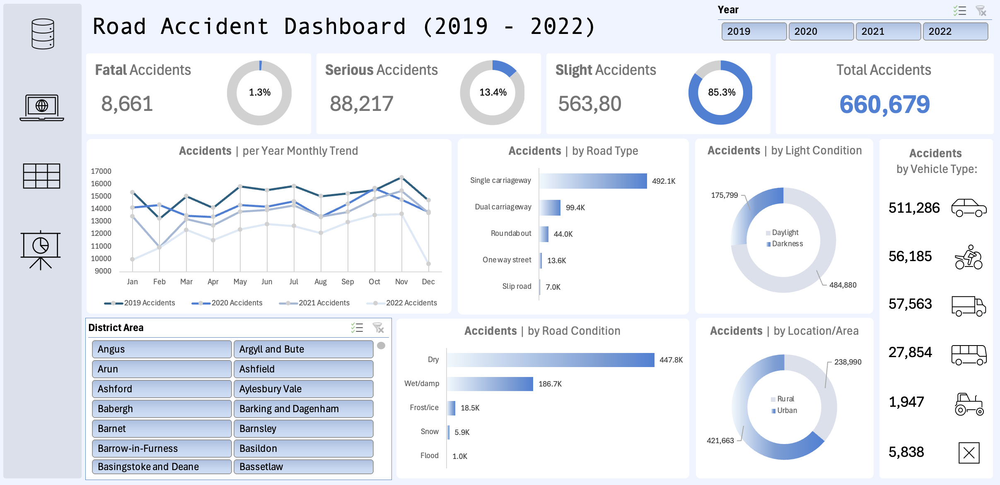

# Road Collisions Analysis (2019 - 2022)
Road accident dashboard for years 2019 - 2022 in the UK.
   

    

## Motivation
Understanding Accident Severity for Effective Road Management.   
**Goal:**  Gain insights into the patterns and trends of road accidents in the UK from 2019 to 2022 to inform policy-making and improve road safety.   

## Task List
1. Clean Database
2. Create Dashboard

## Metrics and Dimensions
- **Total** number of accidents
- **Accident Severity:** Accidents and percentage of total with respect to accident severity
- **Vehicle:** Total accidents by type of vehicle
- **Accidents per Year:** Monthly trend showing a comparison of accidents for the current year and the previous year
- **Road Type:** accidents by road type
- **Light Condition:** accidents by day/night
- **Road Condition:** Distribution of total casualties by road condition
- **Location/Area:** The type of area where the collision takes place
- Relationship between accidents by area/location and by day/night
  
## Summary of Insights
  
#### Accident Severity
- The majority of accidents are _slight_, accounting for 85.3% of the total.
- Fatal accidents constitute only 1.3% of the total.
- Serious accidents make up 13.4% of the total.

#### Vehicle
- Regular cars are most frequently involved in accidents, followed by motorcycles.

#### Accidents per year 
- Accident rates are consistently high from May to July across all four years.
- Most years see a peak in accidents in November.
- February typically has the lowest number of accidents each year.

#### Road Type
- Single-carriageway roads witness the highest number of collisions (492.1K).
- The least amount of collisions occur on a slip road

#### Light Condition
- The majority of collisions occur during daytime (approximately 75%)

#### Road Condition
- Most collisions occur on dry roads (447.8K)
- Collisions on flooded roads are rare (1.0K), likely due to the infrequency of floods.

#### Location/Area
- The majority of collisions occur in rural areas, likely due to the higher population density in these areas.

## Recommended Next Steps
- Collaborate with Stakeholders (Department for Transport, Road Safety Corps, Traffic Management agencies, etc.)
- Engage with local authorities, transport agencies, and road safety organizations to share insights and collaborate on safety initiatives.
- Use the findings to support grant applications and funding requests for road safety projects.

## Data
The dataset used in this project is available publicly on Kaggle: [https://www.kaggle.com/datasets/nezukokamaado/road-accident-casualties-dataset](https://www.kaggle.com/datasets/nezukokamaado/road-accident-casualties-dataset)

## Technologies
- Excel
